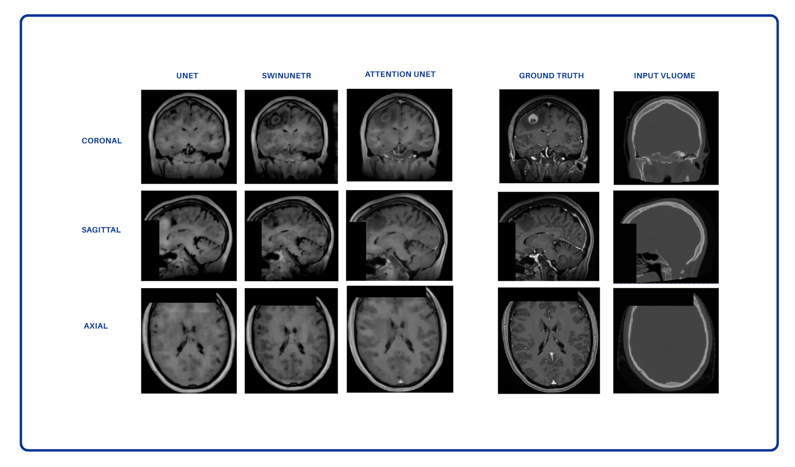

# Volumetric MRI-to-CT Brain Synthesis

This project provides a deep learning framework for volumetric MRI synthesis for brain images. It leverages fully volumetric GAN training,validation and test.

> To do more collaboration , please contact the author , mehrankhodadadzadeh90@gmail.com
  # Example Output

---

#What This Framework Does

- Translates CT brain volumes to synthetic MRI using three different architectures including the UNet, Attention UNet and SwinUNetR.
- Utilizes patch-wise GAN training for memory-efficient learning.
- Evaluates voxel-level fidelity using MAE, PSNR, and SSIM inside anatomical masks.
- Supports both training and k-fold cross-validation modes.
- These modifications can be adjusted easily from Main.py.

---

#Dataset Format

Each patient folder should contain:

dataset_root/
├── patient001/
│ ├── mr.nii.gz # ground-truth MRI 
│ ├── ct.nii.gz # input CT
│ └── mask.nii.gz # evaluation mask

To train the model:

python main.py

For any academic, research, or commercial usage, kindly reference this repository or contact the author for collaboration.

📦Requirements
You can install dependencies via:

pip install -r requirements.txt

Or manually:

torch==2.1.2
monai
nibabel
scikit-image
scikit-learn
wandb
tqdm
numpy
